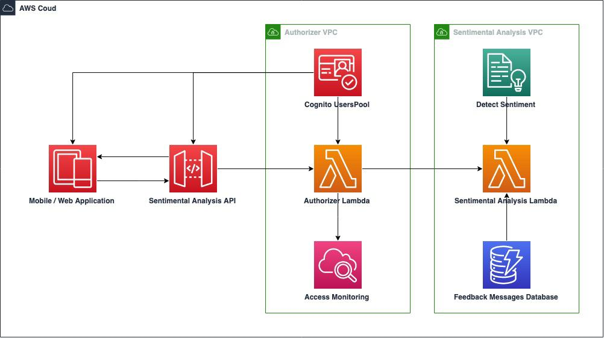
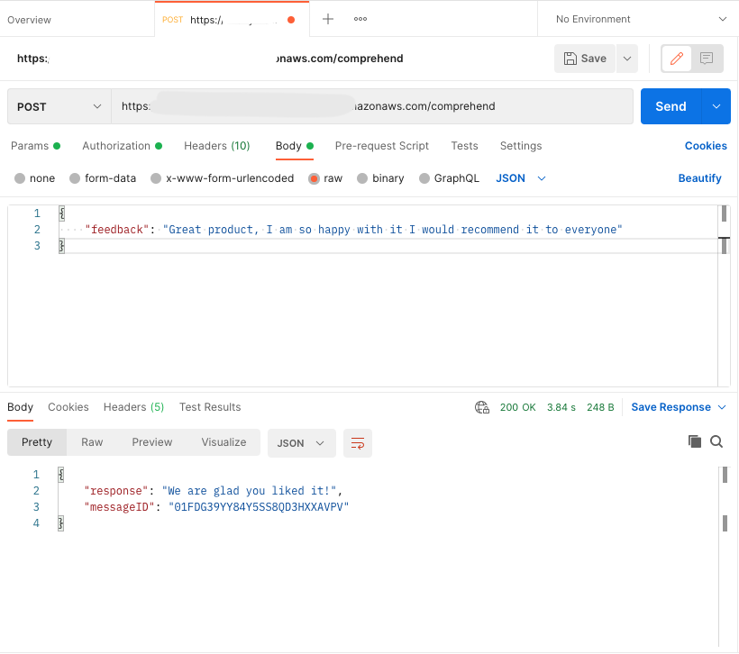
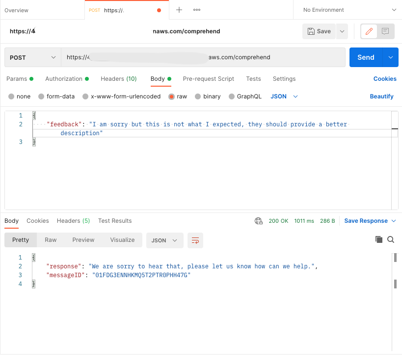
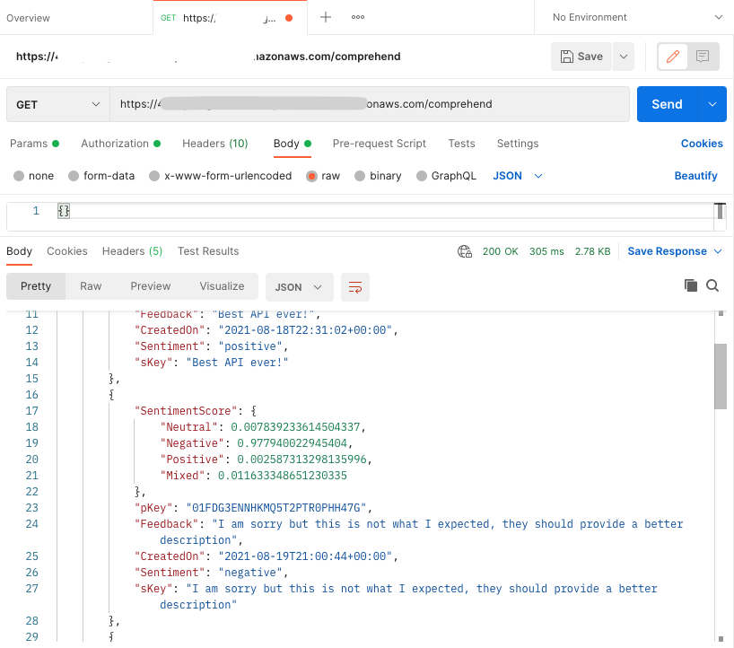

# Sentimental Analysis solution with CDK

## What are we building here?

<p align="center">
  
</p>

### CDK Stack

* 📄 **AwsAssignmentStack**    contains the main stack, allocate resources and stablish relationships

### CDK Construtcs
* 📄 **ApiAuthorizerConstruct**    creates the Cognito user pool and the authorizer behind the API
* 📄 **SentimentAnalyzerConstruct**    analyze feedback submissions and store results

### Functions
* 📄 Authorizer Lambda 
* 📄 Sentimental Analysis Lambda

***

## Working with CDK

 * `npm run build`   compile typescript to js
 * `npm run watch`   watch for changes and compile
 * `cdk deploy`      deploy this stack to your default AWS account/region
 * `cdk diff`        compare deployed stack with current state
 * `cdk synth`       emits the synthesized CloudFormation template

***

## Authorization and adding users to Cognito

When deploying your stack you will get the folling outputs:

* `API-endpoint` including main path
* `userPoolId`
* `userPoolClientId`

To register a new user - via **AWS-CLI**

1. Register the user
```
aws cognito-idp sign-up \
  --client-id userPoolClientId \
  --username your_email \
  --password your_password
```

2. Confirm the user
```
aws cognito-idp admin-confirm-sign-up \
  --user-pool-id userPoolId \
  --username your_email
```

3. Log the user and get the IdToken 

From the response use the `IdToken` to call the API
```
aws cognito-idp initiate-auth \
  --auth-flow USER_PASSWORD_AUTH \
  --auth-parameters \
  USERNAME=your_email,PASSWORD=your_password \
  --client-id userPoolClientId
```

***

## Testing

Fine-Grained Assertion Tests included for all constructs and main stack.

 * `npm run test`    perform the jest unit tests

***

## Using the API

We can use an API Platform like [postman](https://www.postman.com/)

When calling GET method, we include the feedback message inside the body.

```
body: {
  feedback: "Best API ever!"
}
```
In the response we will see a different message depending on the sentiment obtained and the messageID


### POST METHOD - Positive feedback
<p align="center">
  
</p>

### POST METHOD - Negative feedback
<p align="center">
  
</p>

### GET METHOD
<p align="center">
  
</p>

***

## Future iterations
- [ ] SPA Auth with Cognito in AWS Amplify
- [ ] Synchronous Workflows with AWS Step Functions
